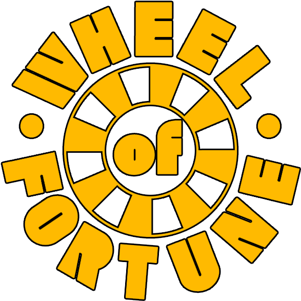

<p align="center" style="margin-bottom: 0px !important;">
  
</p>
<h1 align="center" style="margin-top: 0px;">Wheel Of Fortune</h1>

<p align="center" >a Java server/client CLI implementation of the television game</p>

<div align="center">

 
 

</div>

> [!NOTE]
> This program was written as our second practical work during the [DAI course](https://github.com/heig-vd-dai-course/heig-vd-dai-course/tree/main) of 2024 at the [HEIG-VD](https://heig-vd.ch).

> [!IMPORTANT]
> We do not claim any copyright over the original game show and its game mechanics. This project was developed for educational purposes only. However, the code for this implementation is totally original and written by us.

## Authors

- Pedro Alves da Silva ([@PedroAS7](https://github.com/PedroAS7))
- Gonçalo Carvalheiro Heleno ([@lentidas](https://github.com/lentidas))

# Table of Contents

- [Table of Contents](#table-of-contents)
  - [Usage](#usage)
    - [Build Docker image](#build-docker-image)
    - [Print the help message](#print-the-help-message)
    - [Start the server](#start-the-server)
  - [Documentation](#documentation)
  - [Contributing](#contributing)
    - [Clone and build the project](#clone-and-build-the-project)

## Usage

// TODO: Finish usage instructions

This program is a CLI-only server/client implementation of the television game show Wheel of Fortune. 

The executable contains the code for both the server and the client. As such, it has two main commands: `server` and `client`. Each command sets up a server or a client, respectively.

The server is responsible for managing the game state and the clients are responsible for interacting with the server to play the game. The server can handle multiple clients at the same time, up to a maximum of 5 players.

The server and the client communicate using a custom protocol over TCP, either through IPv4 or IPv6. **The server JAR executable listens on all interfaces and port `1234` by default.**

The full protocol specification is available in [this document](./docs/protocol-specification.pdf).

> [!NOTE]
> For compatibility through multiple operating systems, we recommend you run this program using Docker. You can still run the JAR we release, but ensure you have Java 21 or later installed on your machine.

> [!NOTE]
> The way you launch the program is different if you are using Docker or not, that is, the command line arguments are the same but the invocation of the program is different.
>
> However, after the program is running, the protocol communication between the server and the client is the same for both cases.

> [!IMPORTANT]
> The server and client must be running on the same network to communicate with each other. Other network configurations are possible, but have not been tested.

### Build Docker image

The image to run the program is available alongside the releases of this repository:

```shell
# Pull the image from GitHub Container Registry.
docker pull ghcr.io/lentidas/dai-2425-pw2:latest
```

You can also build the image yourself using the provided Dockerfile:

```shell
# Clone the repository.
git clone https://github.com/lentidas/DAI-2425-PW2.git

# Change to the project directory.
cd DAI-2425-PW2

# Build the Docker image.
docker build -t wheel-of-fortune:latest .
```

> [!NOTE]
> For the following sections, adapt the commands to use the image you built or pulled from the GitHub Container Registry.

### Print the help message

To print the help message, you can use the following commands:

```shell
# Print the help message for the server.
docker run ghcr.io/lentidas/dai-2425-pw2:latest server --help

# Starting the container without arguments defaults to printing the help message for the server.
docker run ghcr.io/lentidas/dai-2425-pw2:latest
```

### Start the server

To start the server, you can use the following commands:

```shell
# Run the server with default settings.
docker run ghcr.io/lentidas/dai-2425-pw2:latest server

# Run the server with a different port.
docker run --expose 10042 ghcr.io/lentidas/dai-2425-pw2:latest server --port 10042
docker run --expose 10042 ghcr.io/lentidas/dai-2425-pw2:latest server -p 10042

# Listen only on localhost (the container won't get any communication from other containers).
docker run ghcr.io/lentidas/dai-2425-pw2:latest server --bind 127.0.0.1
docker run ghcr.io/lentidas/dai-2425-pw2:latest server -b '[::1]' # IPv6

# Customize the listening address and port on the same parameter. Note that the listening address should be one in the 
# internal Docker network.
docker run --expose 10042 ghcr.io/lentidas/dai-2425-pw2:latest server --bind 10.0.0.1:10042

# The above examples only allow connections between server and client containers. You can publish the port and map it
# to your host to allow connections from outside the Docker network.
docker run -p 1234:1234 ghcr.io/lentidas/dai-2425-pw2:latest server
# You can then connect to that container using the JAR from the same machine.
```

> [!NOTE]
> The `Dockerfile` exposes the port `1234` by default. As you noted from the examples above, if you want to change the port of the program using the `-p` or `-b` flags, you must also expose the same port when running the container.


## Documentation

The documentation of the Java code of our program is published as a GitHub pages alongside this repository [on this address](https://lentidas.github.io/DAI-2425-PW2/).

The full protocol specification is available in [this document](./docs/protocol-specification.pdf).

The CLI usage instructions are available in the [Usage](#usage) section of this README.

## Contributing

You are welcome to contribute and improve this project. Below you will find some guidelines to help you get started.

- We try to follow the Semantic Versioning guidelines as much as possible. You can find more information about it [here](https://semver.org/).
- The releases for this project are automated using [Release Please](https://github.com/googleapis/release-please-action).
- As a consequence of the previous 2 points, we use the Conventional Commits specification for our commit messages. You can find more information about it [here](https://www.conventionalcommits.org/).
- We license our code under the GNU General Public License v3.0. You can find it [here](./LICENSE.txt). A copyright header template for the source files is provide [here](./.idea/copyright/DAI_PW2_GNUv3.xml).

### Clone and build the project

We use [Maven](https://maven.apache.org/) to manage our project. The Maven wrapper is versioned alongside with the rest of the code, as well as some project configurations for [IntelliJ IDEA from Jetbrains](https://www.jetbrains.com/idea/). These project files contain run configurations that you can use to run the program from the IDE.

To clone and build the project on the command line, you can use the following commands:

```shell
# Clone the repository.
git clone https://github.com/lentidas/DAI-2425-PW2.git

# Change to the project directory.
cd DAI-2425-PW2

# Modify the code as you wish.

# Check that the code is well formatted...
./mvnw spotless:check

# ...and eventually format it.
./mvnw spotless:apply

# Build the project with the dependencies.
./mvnw dependency:go-offline clean compile package

# Run the program (do not forget to adjust the version accordingly).
java -jar target/wheel-of-fortune-1.0.0.jar --help
```
