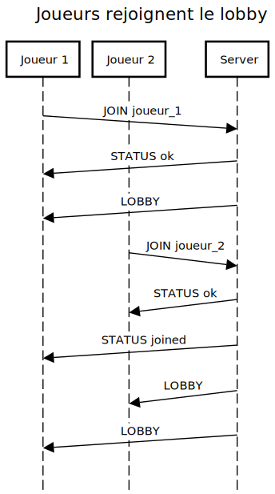
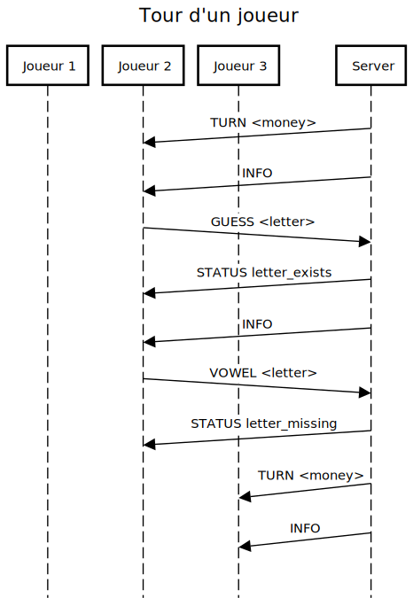
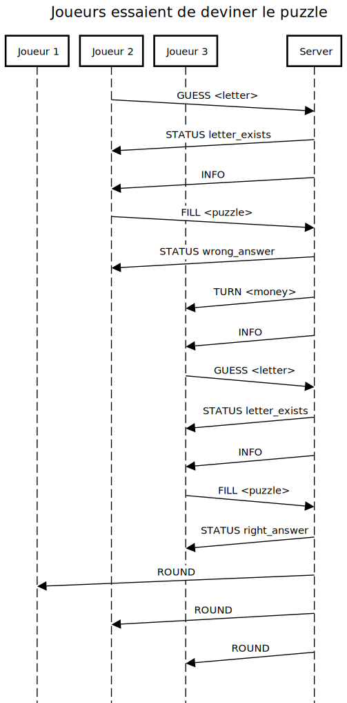
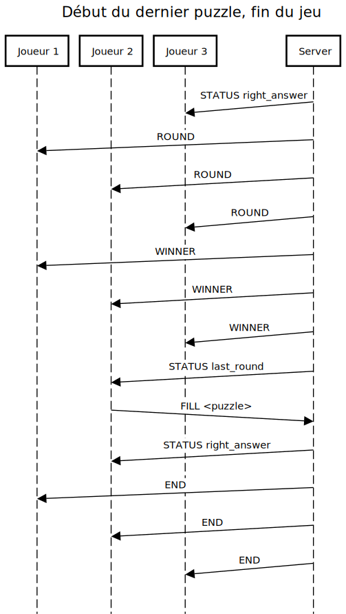

# Messages

| Message   | Server $\rightarrow$ Client | Server $\leftarrow$ Client  | Description             |
|:----------|:------------:|:------------:|:------------------------------------------------------|
| `END`     | $\checkmark$ |              | Annonce de la fin du jeu, avec résultats              |
| `FILL`    |              | $\checkmark$ | Le joueur essaye de compléter le puzzle               |
| `GUESS`   |              | $\checkmark$ | Le joueur essaye devine une consonne                  |
| `INFO`    | $\checkmark$ |              | Envoit les toutes dernières informations de la manche |
| `LAST`    | $\checkmark$ |              | Demande au gagnant de deviner le puzzle               |
| `LOBBY`   | $\checkmark$ |              | Envoie la liste actuelle de joueurs dans la partie    |
| `JOIN`    |              | $\checkmark$ | Demande au serveur d'authoriser un joueur à rejoindre |
| `QUIT`    |              | $\checkmark$ | Demande la déconnection d'un joueur                   |
| `ROUND`   | $\checkmark$ |              | Fin de tour: le puzzle a été résolu                   |
| `STATUS`  | $\checkmark$ | $\checkmark$ | Renvoit un code de status à l'autre bout              |
| `TURN`    | $\checkmark$ |              | Le serveur tourne la roue pour un joueur              |
| `VOWEL`   |              | $\checkmark$ | Le joueur achète une voyelle                          |
| `WINNER`  | $\checkmark$ |              | Annonce le gagnant des manches. Début du dernier puzzle |

: Liste de tous les messages qui peuvent être échangés

## Notes d'implémentation

Afin de simplifier ce laboratoire, nous avons pris les choix suivants:

- Les commandes sont envoyées en clair

- Le serveur ne vérifie pas que le joueur qui a envoyé la commande est celui qui doit répondre

- Les joueurs ne peuvent pas envoyer arbitrairement des commandes au serveur, car ils devront
  attendre que le serveur interagisse avec eux. Exception pour les commandes `JOIN` et `QUIT`

- D'après les règles du jeu, la lettre 'Y' est une consonne, et ne peut, donc, pas être achetée
  avec la commande `VOWEL`

## `END`

### Description

Cette commande annonce la fin du jeu à tous les joueurs dans le lobby. Cette command fourni les
résultats finaux, permettant l'application Client de les afficher à l'écran pour que les joueurs
puissent les lire.

### Format, paramètres, réponses acceptées

| Nom                         | Description                                                       |
|:----------------------------|-------------------------------------------------------------------|
| Format                      | `END <winner> <player_1> <money1_> ... <player_n> <money_n>`      |
| Server $\rightarrow$ Client | $\checkmark$                                                      |
| Client $\rightarrow$ Server |                                                                   |
| Réponses acceptées          | Aucune                                                            |

: Tableau du format et réponse acceptées

#### Paramètres

| Nom    | Taille [B] | Description                                                               |
|:-------|:----------:|:--------------------------------------------------------------------------|
| winner | k          | Username du joueur qui a gagné. Si aucun joueur a gagné, username = "-"   |
| player_n | m        | Username du joueur $n$ de la liste                                        |
| money_n | 4         | Argent gagné par le joueur $n$ de la liste                                |

: Paramètres de la commande

## `FILL`

### Description

Cette commande est utilisée quand le joueur veut tenter sa chance en devinant le puzzle.

### Format, paramètres, réponses acceptées

| Nom                         | Description                                                       |
|:----------------------------|-------------------------------------------------------------------|
| Format                      | `FILL <puzzle>`                                                   |
| Server $\rightarrow$ Client |                                                                   |
| Client $\rightarrow$ Server | $\checkmark$                                                      |
| Réponses acceptées          | `STATUS wrong_answer` si la réponse est fausse                    |
|                             | `STATUS right_answer` si la réponse est correcte                  |

: Tableau du format et réponse acceptées

#### Paramètres

Le paramètre `puzzle` ne doit pas contenir des espaces. Tous les espaces sont remplacés par des
underscores (caractère `_`). Les lettres sont case-insensitive, mais doivent être envoyées en
majuscule.

| Nom    | Taille [B] | Description                                                               |
|:-------|:----------:|:--------------------------------------------------------------------------|
| puzzle | n          | Tentative de résolution du puzzle                                         |

: Paramètres de la commande

## `GUESS`

### Description

Utilisée lors du début du tour, quand le joueur essaye de deviner une consonne qui peut se trouver
dans le puzzle à résoudre.

### Format, paramètres, réponses acceptées

| Nom                         | Description                                                       |
|:----------------------------|-------------------------------------------------------------------|
| Format                      | `GUESS <letter>`                                                  |
| Server $\rightarrow$ Client |                                                                   |
| Client $\rightarrow$ Server | $\checkmark$                                                      |
| Réponses acceptées          | `STATUS timeout` si le joueur n'a pas répondu à temps             |
|                             | `STATUS letter_missing` si la lettre n'existe pas dans le puzzle  |
|                             | `STATUS letter_exists` si la lettre existe dans le puzzle         |
|                             | `STATUS wrong_format` si la lettre n'est pas une consonne         |
|                             | `STATUS already_tried` si la lettre a déjà été utilisée           |

: Tableau du format et réponse acceptées

#### Paramètres

Le paramètre `puzzle` ne doit pas contenir des espaces. Tous les espaces sont remplacés par des
underscores (caractère `_`). La lettre est case-insensitive, mais doit être envoyée en majuscule.

| Nom    | Taille [B] | Description                                                               |
|:-------|:----------:|:--------------------------------------------------------------------------|
| letter | 1          | Consonne à vérifier par le serveur                                        |

: Paramètres de la commande

## `INFO`

### Description

Fourni les toutes dernières informations de la manche à un joueur. L'envoi de cette commande
démarre le timer d'attente de la réponse du joueur.

### Format, paramètres, réponses acceptées

| Nom                         | Description                                                       |
|:----------------------------|-------------------------------------------------------------------|
| Format                      | `INFO <puzzle> <used_letters>`                                    |
| Server $\rightarrow$ Client | $\checkmark$                                                      |
| Client $\rightarrow$ Server |                                                                   |
| Réponses acceptées          | `GUESS` quand le joueur essaie de deviner une consonne            |

: Tableau du format et réponse acceptées

#### Paramètres

Le paramètre `puzzle` ne doit pas contenir des espaces. Tous les espaces sont remplacés par des
underscores (caractère `_`). De plus, les cases à trouver sont remplacées par `*`. Les lettres sont
case-insensitive, mais doivent être envoyées en majuscule.

| Nom    | Taille [B] | Description                                                               |
|:-------|:----------:|:--------------------------------------------------------------------------|
| puzzle | n          | Puzzle à trouver                                                          |

: Paramètres de la commande

## `LOBBY`

### Description

Fourni la liste de tous les joueurs actuellement connectés dans la partie.

### Format, paramètres, réponses acceptées

| Nom                         | Description                                                       |
|:----------------------------|-------------------------------------------------------------------|
| Format                      | `LOBBY <player_1> ... <player_n>`                                 |
| Server $\rightarrow$ Client | $\checkmark$                                                      |
| Client $\rightarrow$ Server |                                                                   |
| Réponses acceptées          | Aucune                                                            |

: Tableau du format et réponse acceptées

#### Paramètres

| Nom      | Taille [B] | Description                                                               |
|:---------|:----------:|:--------------------------------------------------------------------------|
| player_n | k          | Username du joueur dans le lobby                                          |

: Paramètres de la commande

## `JOIN`

### Description

Demande au serveur l'authorisation de connection d'un joueur.

### Format, paramètres, réponses acceptées

| Nom                         | Description                                                       |
|:----------------------------|-------------------------------------------------------------------|
| Format                      | `JOIN <username>`                                                 |
| Server $\rightarrow$ Client |                                                                   |
| Client $\rightarrow$ Server | $\checkmark$                                                      |
| Réponses acceptées          | `STATUS ok` si le serveur a accepté la connection                 |
|                             | `STATUS full` si la partie est déjà au complet                    |
|                             | `STATUS wrong_format` si l'username n'est pas valable             |
|                             | `STATUS duplicate_name` si un autre joueur avec ce username est déjà dans la partie |

: Tableau du format et réponse acceptées

#### Paramètres

Le nom de l'utilisateur ne doit contenir que les caractères `[a-zA-Z0-9_]`. Tout autre caractère
doit forcer le serveur à envoyer `STATUS wrong_format`.

| Nom      | Taille [B] | Description                                                               |
|:---------|:----------:|:--------------------------------------------------------------------------|
| username | k          | Username souhaité                                                         |

: Paramètres de la commande

## `QUIT`

### Description

Informe le serveur de la déconnection d'un joueur.

### Format, paramètres, réponses acceptées

| Nom                         | Description                                                       |
|:----------------------------|-------------------------------------------------------------------|
| Format                      | `QUIT <username>`                                                 |
| Server $\rightarrow$ Client |                                                                   |
| Client $\rightarrow$ Server | $\checkmark$                                                      |
| Réponses acceptées          | Aucune                                                            |

: Tableau du format et réponse acceptées

#### Paramètres

Le nom de l'utilisateur ne doit contenir que les caractères `[a-zA-Z0-9_]`. Tout autre caractère
doit faire en sorte que le serveur réponde avec `STATUS wrong_format`.

| Nom      | Taille [B] | Description                                                               |
|:---------|:----------:|:--------------------------------------------------------------------------|
| username | k          | Username souhaité                                                         |

: Paramètres de la commande

## `ROUND`

### Description

Informe tous les joueurs de la fin de la manche.

### Format, paramètres, réponses acceptées

| Nom                         | Description                                                       |
|:----------------------------|-------------------------------------------------------------------|
| Format                      | `ROUND <puzzle>`                                                 |
| Server $\rightarrow$ Client | $\checkmark$                                                      |
| Client $\rightarrow$ Server |                                                                   |
| Réponses acceptées          | Aucune                                                            |

: Tableau du format et réponse acceptées

#### Paramètres

Le paramètre `puzzle` ne doit pas contenir des espaces. Tous les espaces sont remplacés par des
underscores (caractère `_`).

| Nom    | Taille [B] | Description                                                               |
|:-------|:----------:|:--------------------------------------------------------------------------|
| puzzle | k          | Le puzzle complété                                                        |

: Paramètres de la commande

## `START`

### Description

Informe tous les joueurs du début de une nouvelle manche.

### Format, paramètres, réponses acceptées

| Nom                         | Description                                                       |
|:----------------------------|-------------------------------------------------------------------|
| Format                      | `START <round_number> <puzzle>`                                   |
| Server $\rightarrow$ Client | $\checkmark$                                                      |
| Client $\rightarrow$ Server |                                                                   |
| Réponses acceptées          | Aucune                                                            |

: Tableau du format et réponse acceptées

#### Paramètres

Le paramètre `puzzle` ne doit pas contenir des espaces. Tous les espaces sont remplacés par des
underscores (caractère `_`). De plus, les cases à trouver sont remplacées par `*`. Les lettres sont
case-insensitive, mais doivent être envoyées en majuscule.

| Nom          | Taille [B] | Description                                                         |
|:-------------|:----------:|:--------------------------------------------------------------------|
| round_number | 1          | Le numéro de la manche qui a commencé                               |
| puzzle       | k          | Le puzzle à compléter                                               |

: Paramètres de la commande

## `STATUS`

### Description

Un des clients fournit une réponse à une information venant du serveur, ou le serveur fournit une
réponse à une information venant du client. La liste des codes de réponse est connue par les deux
parties. Dans un projet plus conséquent, une vérification de version entre Serveur
$\leftrightarrow$ Client s'imposerait pour s'assurer que les deux ont des versions compatibles.
Toutefois, pour un laboratoire de cette taille, nous avons jugé ce point dénecessaire.

### Format, paramètres, réponses acceptées

| Nom                         | Description                                                       |
|:----------------------------|-------------------------------------------------------------------|
| Format                      | `STATUS <status>`                                                 |
| Server $\rightarrow$ Client | $\checkmark$                                                      |
| Client $\rightarrow$ Server | $\checkmark$                                                      |
| Réponses acceptées          | Aucune                                                            |

: Tableau du format et réponse acceptées

#### Paramètres

| Nom    | Taille [B] | Description                                                               |
|:-------|:----------:|:--------------------------------------------------------------------------|
| Status | 2          | Code du status, au format hexadécimal majuscule                           |

: Paramètres de la commande

### Valeurs acceptées

Les valeurs marquées comme prioritaires doivent toujours exécuter le code lui appartenant, et
ensuite revenir à l'état précédent, à l'exception de `CLOSING` qui oblige le joueur à revenir à
l'état "Idle".

| Valeur | Nom              |    Prio.?    | Description                                                    |
|:------:|:----------------:|:------------:|:---------------------------------------------------------------|
| 0x00   | OK               |              | Réponse acceptée ou acceptable. Requête traitée correctement   |
| 0x01   | KO               |              | Erreur, mais l'erreur ne peut pas être spécifiée               |
| 0x02   | WRONG_FORMAT     |              | Le format de la commande reçue est faux ou incomplet           |
| 0x03   | PLAYER_JOINED    | $\checkmark$ | Un joueur a rejoint la partie. La commande `LOBBY` sera envoyée aussi |
| 0x04   | PLAYER_QUIT      | $\checkmark$ | Un joueur a quitté la partie. La commande `LOBBY` sera envoyée aussi |
| 0x05   | GAME_START       |              | La partie commence. Aucune autre connection n'est possible     |
| 0x06   | LETTER_EXISTS    |              | La lettre fournie existe. Le joueur peut continuer son tour    |
| 0x07   | LETTER_MISSING   |              | La lettre fournie n'existe pas. Le tour du joueur est terminé  |
| 0x08   | TIMEOUT          |              | Le temps est écoulé. Le tour du joueur est terminé             |
| 0x09   | ALREADY_TRIED    |              | La lettre a déjà été utilisée dans le puzzle                   |
| 0x0A   | WRONG_ANSWER     |              | La tentative de résolution du puzzle a échoué. Fin du tour     |
| 0x0B   | RIGHT_ANSWER     |              | La tentative de résolution du puzzle a réussi. Fin de la manche |
| 0x0C   | DUPLICATE_NAME   |              | Un autre joueur avec ce nom est déjà présent dans le lobby     |
| 0x0D   | CLOSING          | $\checkmark$ | Le serveur est en train de fermer. Tous les joueurs quittent   |
| 0x0E   | NO_FUNDS         |              | Le joueur n'a pas assez d'argent pour effectuer l'achat        |
| 0x0F   | SKIP             |              | Le joueur termine son tour sans effectuer d'action             |
| 0x10   | FULL             |              | La partie est au complet                                       |

: Valeur acceptées pour la commande `STATUS`

## `TURN`

### Description

Informe un joueur que ça à son tour.

### Format, paramètres, réponses acceptées

| Nom                         | Description                                                       |
|:----------------------------|-------------------------------------------------------------------|
| Format                      | `TURN <money> <total_money>`                                                    |
| Server $\rightarrow$ Client | $\checkmark$                                                      |
| Client $\rightarrow$ Server |                                                                   |
| Réponses acceptées          | Aucune                                                            |

: Tableau du format et réponse acceptées

#### Paramètres

| Nom          | Taille [B] | Description                                                         |
|:-------------|:----------:|:--------------------------------------------------------------------|
| money        | 2          | Somme d'argent gagnée pour cette manche                             |
| total_money  | 4          | Somme d'argent cumulée depuis le début de la partie                 |

: Paramètres de la commande

## `VOWEL`

Le joueur demande l'achat d'une voyelle spécifique.

### Format, paramètres, réponses acceptées

| Nom                         | Description                                                       |
|:----------------------------|-------------------------------------------------------------------|
| Format                      | `VOWEL <vowel>`                                                   |
| Server $\rightarrow$ Client |                                                                   |
| Client $\rightarrow$ Server | $\checkmark$                                                      |
| Réponses acceptées          | `STATUS letter_exists` si la lettre existe dans le puzzle         |
|                             | `STATUS letter_missing` si la lettre n'existe pas dans le puzzle  |
|                             | `STATUS no_funds` si le joueur n'a pas assez d'argent             |

: Tableau du format et réponse acceptées

#### Paramètres

La lettre est case-insensitive, mais doit être envoyée en majuscule.

| Nom          | Taille [B] | Description                                                         |
|:-------------|:----------:|:--------------------------------------------------------------------|
| vowel        | 1          | Voyelle demandée                                                    |

: Paramètres de la commande

## `WINNER`

Déclare le gagnant des manches précédentes. Le gagnant participe au dernier round.

### Format, paramètres, réponses acceptées

| Nom                         | Description                                                       |
|:----------------------------|-------------------------------------------------------------------|
| Format                      | `WINNER <username>`                                               |
| Server $\rightarrow$ Client | $\checkmark$                                                      |
| Client $\rightarrow$ Server |                                                                   |
| Réponses acceptées          | Aucune                                                            |

: Tableau du format et réponse acceptées

#### Paramètres

| Nom          | Taille [B] | Description                                                         |
|:-------------|:----------:|:--------------------------------------------------------------------|
| username     | k          | Username du joueur qui participe à la dernière manche               |

: Paramètres de la commande

# Diagramme de séquence

## Connection d'un joueur

Un joueur envoie son username comme paramètre de la commande `JOIN`. Si la requête est acceptée par
le serveur, il répondra avec un `STATUS` acceptable. La commande `STATUS` est envoyée aux autres
joueurs dans le lobby pour les informer qu'un joueur a rejoint la partie. La command `LOBBY` est
ensuite envoyée à chacun des joueurs dans le lobby.

{ width=40% }

<!--
title Joueurs rejoignent le lobby

participant Joueur 1
participant Joueur 2
participant Server

Joueur 1->(1)Server:JOIN joueur_1
Server->(1)Joueur 1: STATUS ok
Server->(1)Joueur 1: LOBBY

Joueur 2->(1)Server:JOIN joueur_2
Server->(1)Joueur 2: STATUS ok
Server->(1)Joueur 1: STATUS joined
Server->(1)Joueur 2: LOBBY
Server->(1)Joueur 1: LOBBY
-->

## Tour d'un joueur

Le serveur informe un joueur que son tour a commencé. Il reçoit la somme d'argent obtenue, ainsi
que le puzzle à résoudre. À la fin de son tour, le serveur effectuera le même échange avec le
prochain participant dans la liste des joueurs.

{ width=40% }

<!--
title Tour d'un joueur

participant Joueur 1
participant Joueur 2
participant Joueur 3
participant Server

Server->(1)Joueur 2: TURN <money>
Server->(1)Joueur 2: INFO
Joueur 2->(1)Server: GUESS <letter>
Server->(1)Joueur 2: STATUS letter_exists
Server->(1)Joueur 2: INFO
Joueur 2->(1)Server: VOWEL <letter>
Server->(1)Joueur 2: STATUS letter_missing
Server->(1)Joueur 3: TURN <money>
Server->(1)Joueur 3: INFO
-->

## Fin de manche

Lorsqu'un joueur devine correctement le puzzle, la fin de la manche est annoncée à chacun des
joueurs dans la partie.

{ width=40% }

<!--
title Fin de manche

participant Joueur 1
participant Joueur 2
participant Joueur 3
participant Server

Joueur 2->(1)Server: GUESS <letter>
Server->(1)Joueur 2: STATUS letter_exists
Server->(1)Joueur 2: INFO
Joueur 2->(1)Server: FILL <puzzle>
Server->(1)Joueur 2: STATUS wrong_answer
Server->(1)Joueur 3: TURN <money>
Server->(1)Joueur 3: INFO
Joueur 3->(1)Server: GUESS <letter>
Server->(1)Joueur 3: STATUS letter_exists
Server->(1)Joueur 3: INFO
Joueur 3->(1)Server: FILL <puzzle>
Server->(1)Joueur 3: STATUS right_answer
Server->(1)Joueur 1: ROUND
Server->(1)Joueur 2: ROUND
Server->(1)Joueur 3: ROUND
-->

## Fin du jeu

Lors de la dernière partie du jeu, le gagnant de toutes les manches précédentes est annoncé, et
doit trouver le puzzle qui lui est affiché à l'écran. S'il parvient à la résoudre correctement dans
le temps qui lui a été imparti, il gagne le jeu. Même s'il ne le gagne pas, tous les joueurs
reçoivent le résultat du jeu.

{ width=40% }

<!--
title Début du dernier puzzle, fin du jeu

participant Joueur 1
participant Joueur 2
participant Joueur 3
participant Server

Server->(1)Joueur 3: STATUS right_answer
Server->(1)Joueur 1: ROUND
Server->(1)Joueur 2: ROUND
Server->(1)Joueur 3: ROUND
Server->(1)Joueur 1: WINNER
Server->(1)Joueur 2: WINNER
Server->(1)Joueur 3: WINNER
Server->(1)Joueur 2: STATUS last_round
Joueur 2->(1)Server: FILL <puzzle>
Server->(1)Joueur 2: STATUS right_answer
Server->(1)Joueur 1: END
Server->(1)Joueur 2: END
Server->(1)Joueur 3: END
-->

# Lifecycles

## Client

TODO

## Server

TODO
