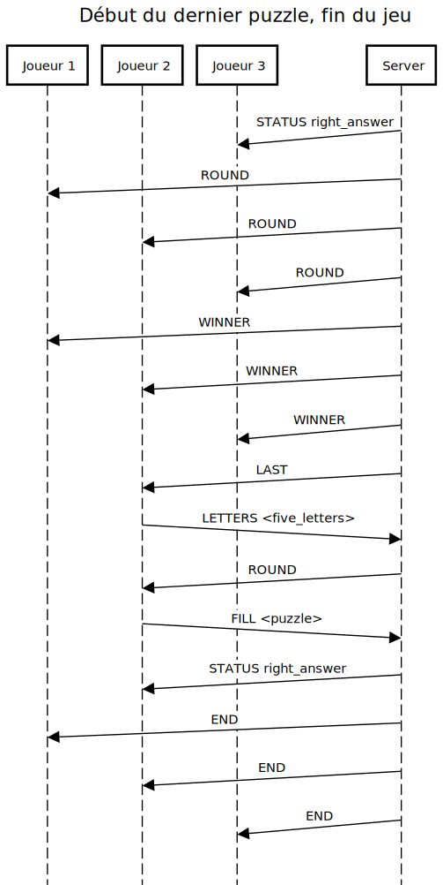

# Overview du protocole

Ce protocole permet d'implémenter les intéractions serveur $\leftrightarrow$ client pour permettre
à plusieurs clients de jouer à ["Wheel of Fortune"](https://www.wheeloffortune.com/).

## Description du jeu télévisé

Dans le jeu télévisé, les joueurs se réunissent autour d'une roue divisée en plusieurs parties,
appelées de *wedges*. Celles-ci peuvent soit contenir un prix, soit passer leur tour, soit leur
enlever l'argent cumulé depuis le début de la partie. Les *wedges* contenant les prix peuvent
contenir soit:

- Une somme d'argent fixe à gagner
- Une somme d'argent fixe, cachée à gagner
- Un voyage offert
- Le jackpot d'un million de dollars
- Quelques prix supplémentaires selon les éditions du jeu

Chaque manche commence avec l'affichage du puzzle à trouver, ainsi que sa catégorie. Lorsqu'un
joueur tourne la roue et tombe sur une *wedge* prix, il devra deviner une consonne qui doit se
trouver sur le puzzle de la manche. La consonne ne doit pas encore été utilisée. Si la consonne
n'existe pas sur la puzzle, le tour fini, et le prochain joueur commence son tour. Si la consonne
existe, le joueur a trois choix:

- Acheter une voyelle, dont le prix augmente à chaque manche
- Tenter de dire ce qui se cache derrière le puzzle
- Passer son tour s'il n'est pas possible d'acheter une voyelle, et le joueur ne veut pas tenter
  sa chance en remplissant le puzzle

Dans le cas où le joueur achète une voyelle, et que celle-ci existe sur le puzzle, le joueur
gagne le prix fois le nombre de fois que ladite voyelle apparaît sur le puzzle. Son tour recommence.
Si la voyelle n'existe pas, le prochain joueur commence son tour. Si le joueur devinne correctement
le puzzle, la manche se termine immédiatement, et le joueur remporte la manche.

Après plusieurs manches, seul le joueur ayant la somme d'argent la plus haute participe au dernier
puzzle. Le puzzle contient 5 lettres déjà dévoilées: R, S, T, E, L, et N. Celles-ci sont les lettres
les plus probables de trouver dans un texte en anglais. Le joueur doit, ensuite, donner 5 lettres de
son choix pour qu'elles soient dévoilées sur le puzzle aussi. Ensuite, il y a une quantité maximale
de temps pour trouver le puzzle au complet, sans pouvoir deviner d'autres lettres.

Afin d'éviter un long temps d'attente de la réponse du joueur en train de jouer, le jeu télévisé
utilise des temps de réponse maximales. Si le joueur dépasse ce temps de réponse lors d'une manche
normale, il perd son tour. S'il dépasse ce temps lors de la dernière manche, il perd la partie.

## Description du jeu numérique

Lorsque les joueurs se connectent au serveur, ils se retrouvent dans une salle d'attente, en
attendant qu'un joueur démarre la partie. Lorsque la partie est démarrée, un puzzle est choisi, et
le premier joueur à se connecter au serveur reçoit une *wedge* aléatoirement choisie par le serveur.
Selon son type, tout comme pour le jeu télévisé, il peut soit perdre son tour, soit faire faillite,
soit tomber sur une *wedge* contenant un prix.

Ce protocole n'a pas été pensé pour inclure les *wedges* spéciales, telles que celles contenant un
montant caché, ou un voyage offert.

Le joueur doit, alors, effectuer les mêmes étapes comme s'il se trouvait dans le jeu télévisé.

Au contraire du jeu de TV, ce protocole prévoit du temps maximales dans certaines des commandes,
mais celles-ci sont inutilisées dans la présente version. Ceci veut dire que les joueurs n'ont pas
un temps maximale pour présenter leur réponse, et le serveur ne le vérifie pas non plus.

Les restantes étapes du jeu se déroulent comme le jeu original. Toutefois, après la dernière manche,
tous les joueurs se retrouvent à nouveau dans la salle d'attente, et peuvent reparticiper à une
nouvelle partie.

# Spécifications

Les communications entre les différentes parties sont échangées en texte clair, encodé en UTF-8.

Ces échanges sont faits utilisant le port **TCP** $1234$. Le délimiteur est le caractère `new-line`,
aussi connu par `\n`.

Les joueurs sont ceux qui doivent démarrer la communication.

Les joueurs ne peuvent pas envoyer arbitrairement des commandes au serveur, car ils devront attendre
que le serveur interagisse avec eux. Exception faite pour les commandes `JOIN` et `QUIT`.

D'après les règles du jeu, la lettre 'Y' est une consonne, et ne peut, donc, pas être achetée avec
la commande `VOWEL`.

Plusieurs joueurs peuvent se connecter à partir de la même IP. Ceci permet à des joueurs se trouvant
dans la même maison de se connecter au serveur, mais permet également au même joueur de se connecter
plusieurs fois depuis un même appareil.

Le protocole ne gère pas des permissions par joueur. Ceci fait que n'importe quel joueur peut
démarrer la partie.

Si un joueur quitte la partie lorsque celle-ci est en cours, il ne parviendra pas à se reconnecter.

Les joueurs sont libres de choisir leur nom d'utilisateur, et peuvent être composés de plusieurs
mots, délimités par des doubles guillements ("). Le seul nom d'utilisateur qui n'est pas acceptable
est un simple trait (-), qui est réservépour la commande `END` dans le cas où aucun joueur n'a
remporté la partie.

# Messages

| Message   | Server $\rightarrow$ Client | Server $\leftarrow$ Client | Description                                                  |
|:----------|:---------------------------:|:--------------------------:|:-------------------------------------------------------------|
| `END`     |        $\checkmark$         |                            | Annonce de la fin du jeu, avec résultats                     |
| `FILL`    |                             |        $\checkmark$        | Le joueur essaye de compléter le puzzle                      |
| `GO`      |                             |        $\checkmark$        | Démarre la partie                                            |
| `GUESS`   |                             |        $\checkmark$        | Le joueur essaye devine une consonne                         |
| `INFO`    |        $\checkmark$         |                            | Envoit les toutes dernières informations de la manche        |
| `JOIN`    |                             |        $\checkmark$        | Demande au serveur d'authoriser un joueur à rejoindre        |
| `LAST`    |        $\checkmark$         |                            | Demande au gagnant de deviner le puzzle                      |
| `LETTERS` |                             |        $\checkmark$        | Le joueur fourni 5 lettres à révéler pour la dernière manche |
| `LOBBY`   |        $\checkmark$         |                            | Envoie la liste actuelle de joueurs dans la partie           |
| `QUIT`    |                             |        $\checkmark$        | Demande la déconnection d'un joueur                          |
| `ROUND`   |        $\checkmark$         |                            | Fin de tour: le puzzle a été résolu                          |
| `SKIP`    |                             |        $\checkmark$        | Saute le tour après avoir deviné une consonne                |
| `STATUS`  |        $\checkmark$         |        $\checkmark$        | Renvoit un code de status à l'autre bout                     |
| `TURN`    |        $\checkmark$         |                            | Le serveur tourne la roue pour un joueur                     |
| `VOWEL`   |                             |        $\checkmark$        | Le joueur achète une voyelle                                 |
| `WINNER`  |        $\checkmark$         |                            | Annonce le gagnant des manches. Début du dernier puzzle      |

: Liste de tous les messages qui peuvent être échangés

## `END`

Cette commande annonce la fin du jeu à tous les joueurs dans le lobby. Cette command fourni les
résultats finaux, permettant l'application Client de les afficher à l'écran pour que les joueurs
puissent les lire.

| Nom                         | Description                                                       |
|:----------------------------|-------------------------------------------------------------------|
| Format                      | `END <winner> <player_1> <money1_> ... <player_n> <money_n>`      |
| Server $\rightarrow$ Client | $\checkmark$                                                      |
| Client $\rightarrow$ Server |                                                                   |
| Réponses acceptées          | Aucune                                                            |

: Tableau du format et réponse acceptées

| Nom      | Description                                                               |
|:---------|:--------------------------------------------------------------------------|
| winner   | Username du joueur qui a gagné. Si aucun joueur a gagné, username = "-"   |
| player_n | Username du joueur $n$ de la liste                                        |
| money_n  | Argent gagné par le joueur $n$ de la liste                                |

: Paramètres de la commande

## `FILL`

Cette commande est utilisée quand le joueur veut tenter sa chance en devinant le puzzle.

| Nom                         | Description                                                       |
|:----------------------------|-------------------------------------------------------------------|
| Format                      | `FILL <puzzle>`                                                   |
| Server $\rightarrow$ Client |                                                                   |
| Client $\rightarrow$ Server | $\checkmark$                                                      |
| Réponses acceptées          | `STATUS wrong_answer` si la réponse est fausse                    |
|                             | `STATUS right_answer` si la réponse est correcte                  |

: Tableau du format et réponse acceptées

Le paramètre `puzzle` doit être envoyé entre guillemets. Les lettres sont case-insensitive, mais
doivent être envoyées en majuscule.

| Nom    | Description                                                               |
|:-------|:--------------------------------------------------------------------------|
| puzzle | Tentative de résolution du puzzle                                         |

: Paramètres de la commande

## `GO`

Cette commande démarre la partie.

| Nom                         | Description                                                       |
|:----------------------------|-------------------------------------------------------------------|
| Format                      | `GO`                                                              |
| Server $\rightarrow$ Client |                                                                   |
| Client $\rightarrow$ Server | $\checkmark$                                                      |
| Réponses acceptées          | Aucune réponse attendue                                           |

: Tableau du format et réponse acceptées

## `GUESS`

Utilisée lors du début du tour, quand le joueur essaye de deviner une consonne qui peut se trouver
dans le puzzle à résoudre.

| Nom                         | Description                                                       |
|:----------------------------|-------------------------------------------------------------------|
| Format                      | `GUESS <letter>`                                                  |
| Server $\rightarrow$ Client |                                                                   |
| Client $\rightarrow$ Server | $\checkmark$                                                      |
| Réponses acceptées          | `STATUS timeout` si le joueur n'a pas répondu à temps             |
|                             | `STATUS letter_missing` si la lettre n'existe pas dans le puzzle  |
|                             | `STATUS letter_exists` si la lettre existe dans le puzzle         |
|                             | `STATUS wrong_format` si la lettre n'est pas une consonne         |
|                             | `STATUS already_tried` si la lettre a déjà été utilisée           |

: Tableau du format et réponse acceptées

| Nom    | Taille [B] | Description                                                               |
|:-------|:----------:|:--------------------------------------------------------------------------|
| letter | 1          | Consonne à vérifier par le serveur                                        |

: Paramètres de la commande

## `INFO`

Fourni les toutes dernières informations de la manche à un joueur. L'envoi de cette commande
démarre le timer d'attente de la réponse du joueur.

| Nom                         | Description                                            |
|:----------------------------|--------------------------------------------------------|
| Format                      | `INFO <puzzle> <category> [used_letters]`              |
| Server $\rightarrow$ Client | $\checkmark$                                           |
| Client $\rightarrow$ Server |                                                        |
| Réponses acceptées          | `GUESS` quand le joueur essaie de deviner une consonne |

: Tableau du format et réponse acceptées

Le paramètre `puzzle` et `category` doivent être envoyés entre guillemets. Les lettres sont
case-insensitive, mais doivent être envoyées en majuscule. De plus, les cases à trouver sont
remplacées par `*`.

| Nom          | Description                       |
|:-------------|:----------------------------------|
| puzzle       | Puzzle à trouver                  |
| category     | Catégorie du puzzle               |
| used_letters | Optionnel. Lettres déjà utilisées |

: Paramètres de la commande

## `JOIN`

Demande au serveur l'authorisation de connection d'un joueur.

| Nom                         | Description                                                       |
|:----------------------------|-------------------------------------------------------------------|
| Format                      | `JOIN <username>`                                                 |
| Server $\rightarrow$ Client |                                                                   |
| Client $\rightarrow$ Server | $\checkmark$                                                      |
| Réponses acceptées          | `STATUS ok` si le serveur a accepté la connection                 |
|                             | `STATUS full` si la partie est déjà au complet                    |
|                             | `STATUS wrong_format` si l'username n'est pas valable             |
|                             | `STATUS duplicate_name` si un autre joueur avec ce username est déjà dans la partie |

: Tableau du format et réponse acceptées

| Nom      | Description       |
|:---------|:------------------|
| username | Username souhaité |

: Paramètres de la commande

## `LAST`

Informe un joueur que ça à son tour, et que c'est le dernier puzzle de la partie.

| Nom                         | Description                          |
|:----------------------------|--------------------------------------|
| Format                      | `LAST <timeout> <puzzle> <category>` |
| Server $\rightarrow$ Client | $\checkmark$                         |
| Client $\rightarrow$ Server |                                      |
| Réponses acceptées          | FILL                                 |

: Tableau du format et réponse acceptées

Le paramètre `puzzle` et `category` doivent être envoyés entre guillemets. Les lettres sont
case-insensitive, mais doivent être envoyées en majuscule. De plus, les cases à trouver sont
remplacées par `*`.

| Nom      | Description                                             |
|:---------|:--------------------------------------------------------|
| timeout  | Nombre de secondes, avant que le joueur perde la partie |
| puzzle   | Puzzle à résoudre                                       |
| category | Catégorie du puzzle                                     |

: Paramètres de la commande

## `LETTERS`

Le joueur fourni 5 lettres à réveler sur le puzzle de la dernière manche

| Nom                         | Description                                                    |
|:----------------------------|----------------------------------------------------------------|
| Format                      | `LETTERS <letters>`                                            |
| Server $\rightarrow$ Client |                                                                |
| Client $\rightarrow$ Server | $\checkmark$                                                   |
| Réponses acceptées          | `STATUS ko` si le format est faux                            |
|                             | `STATUS already_tried` si les lettres ont déjà été utilisées |
|                             | `ROUND` si les lettres sont acceptées                        |

: Tableau du format et réponse acceptées

| Nom     | Taille [B] | Description       |
|:--------|:----------:|:------------------|
| letters |     5      | Lettres demandées |

: Paramètres de la commande

## `LOBBY`

Fourni la liste de tous les joueurs actuellement connectés dans la partie.

| Nom                         | Description                                                       |
|:----------------------------|-------------------------------------------------------------------|
| Format                      | `LOBBY <player_1> ... <player_n>`                                 |
| Server $\rightarrow$ Client | $\checkmark$                                                      |
| Client $\rightarrow$ Server |                                                                   |
| Réponses acceptées          | Aucune                                                            |

: Tableau du format et réponse acceptées

| Nom      | Description                                                               |
|:---------|:--------------------------------------------------------------------------|
| player_n | Username du joueur dans le lobby                                          |

: Paramètres de la commande

## `QUIT`

Informe le serveur de la déconnection d'un joueur.

| Nom                         | Description  |
|:----------------------------|--------------|
| Format                      | `QUIT`       |
| Server $\rightarrow$ Client |              |
| Client $\rightarrow$ Server | $\checkmark$ |
| Réponses acceptées          | Aucune       |

: Tableau du format et réponse acceptées

: Paramètres de la commande

## `ROUND`

Informe tous les joueurs de la fin de la manche.

| Nom                         | Description      |
|:----------------------------|------------------|
| Format                      | `ROUND <puzzle>` |
| Server $\rightarrow$ Client | $\checkmark$     |
| Client $\rightarrow$ Server |                  |
| Réponses acceptées          | Aucune           |

: Tableau du format et réponse acceptées

Le paramètre `puzzle` doit être envoyé entre guillemets. Les lettres sont case-insensitive, mais
doivent être envoyées en majuscule.

| Nom    | Description                                                               |
|:-------|:--------------------------------------------------------------------------|
| puzzle | Le puzzle complété                                                        |

: Paramètres de la commande

## `SKIP`

Lorsque le joueur qui joue actuellement envoie cette commande, son tour est sauté. Il n'est
possible de l'envoyer qu'après avoir deviné une consonne.

| Nom                         | Description                                                       |
|:----------------------------|-------------------------------------------------------------------|
| Format                      | `SKIP`                                                              |
| Server $\rightarrow$ Client |                                                                   |
| Client $\rightarrow$ Server | $\checkmark$                                                      |
| Réponses acceptées          | Aucune réponse attendue                                           |

: Tableau du format et réponse acceptées

## `START`

Informe tous les joueurs du début de une nouvelle manche.

| Nom                         | Description                                |
|:----------------------------|--------------------------------------------|
| Format                      | `START <round_number> <puzzle> <category>` |
| Server $\rightarrow$ Client | $\checkmark$                               |
| Client $\rightarrow$ Server |                                            |
| Réponses acceptées          | Aucune                                     |

: Tableau du format et réponse acceptées

Le paramètre `puzzle` et `category` doivent être envoyés entre guillemets. Les lettres sont
case-insensitive, mais doivent être envoyées en majuscule. De plus, les cases à trouver sont
remplacées par `*`.

| Nom          | Description                                                         |
|:-------------|:--------------------------------------------------------------------|
| round_number | Le numéro de la manche qui a commencé                               |
| puzzle       | Le puzzle à compléter                                               |
| category     | La catégorie du puzzle                                              |

: Paramètres de la commande

## `STATUS`

Un des clients fournit une réponse à une information venant du serveur, ou le serveur fournit une
réponse à une information venant du client. La liste des codes de réponse est connue par les deux
parties. Dans un projet plus conséquent, une vérification de version entre Serveur
$\leftrightarrow$ Client s'imposerait pour s'assurer que les deux ont des versions compatibles.
Toutefois, pour un laboratoire de cette taille, nous avons jugé ce point dénecessaire.

| Nom                         | Description                                                       |
|:----------------------------|-------------------------------------------------------------------|
| Format                      | `STATUS <status>`                                                 |
| Server $\rightarrow$ Client | $\checkmark$                                                      |
| Client $\rightarrow$ Server | $\checkmark$                                                      |
| Réponses acceptées          | Aucune                                                            |

: Tableau du format et réponse acceptées

| Nom    | Description                                                               |
|:-------|:--------------------------------------------------------------------------|
| Status | Nom du code de status                                                     |

: Paramètres de la commande

Les valeurs marquées comme prioritaires doivent toujours exécuter le code lui appartenant, et
ensuite revenir à l'état précédent, à l'exception de `CLOSING` qui oblige le joueur à revenir à
l'état "Idle".

| Valeur | Nom              |    Prio.?    | Description                                                    |
|:------:|:----------------:|:------------:|:---------------------------------------------------------------|
|  0x00  | OK               |              | Réponse acceptée ou acceptable. Requête traitée correctement   |
|  0x01  | KO               |              | Erreur, mais l'erreur ne peut pas être spécifiée               |
|  0x02  | PLAYER_JOINED    | $\checkmark$ | Un joueur a rejoint la partie. La commande `LOBBY` sera envoyée aussi |
|  0x03  | PLAYER_QUIT      | $\checkmark$ | Un joueur a quitté la partie. La commande `LOBBY` sera envoyée aussi |
|  0x04  | LETTER_EXISTS    |              | La lettre fournie existe. Le joueur peut continuer son tour    |
|  0x05  | LETTER_MISSING   |              | La lettre fournie n'existe pas. Le tour du joueur est terminé  |
|  0x06  | TIMEOUT          |              | Le temps est écoulé. Le tour du joueur est terminé             |
|  0x07  | ALREADY_TRIED    |              | La lettre a déjà été utilisée dans le puzzle                   |
|  0x08  | WRONG_ANSWER     |              | La tentative de résolution du puzzle a échoué. Fin du tour     |
|  0x09  | RIGHT_ANSWER     |              | La tentative de résolution du puzzle a réussi. Fin de la manche |
|  0x0A  | DUPLICATE_NAME   |              | Un autre joueur avec ce nom est déjà présent dans le lobby     |
|  0x0B  | NO_FUNDS         |              | Le joueur n'a pas assez d'argent pour effectuer l'achat        |
|  0x0C  | FULL             |              | La partie est au complet                                       |
|  0x0D  | LOST_A_TURN      |              | Le joueur a perdu son tour                                     |
|  0x0E  | BANKRUPT         |              | Le joueur a perdu tout son argent, et son tour est passé       |

: Valeur acceptées pour la commande `STATUS`

## `TURN`

Informe un joueur que ça à son tour.

| Nom                         | Description                  |
|:----------------------------|------------------------------|
| Format                      | `TURN <money> <total_money>` |
| Server $\rightarrow$ Client | $\checkmark$                 |
| Client $\rightarrow$ Server |                              |
| Réponses acceptées          | Aucune                       |

: Tableau du format et réponse acceptées

| Nom          | Description                                                                                   |
|:-------------|:----------------------------------------------------------------------------------------------|
| money        | Somme d'argent gagnée pour cette manche                                                       |
| total_money  | Somme d'argent cumulée depuis le début de la partie                                           |

: Paramètres de la commande

## `VOWEL`

Le joueur demande l'achat d'une voyelle spécifique.

| Nom                         | Description                                                       |
|:----------------------------|-------------------------------------------------------------------|
| Format                      | `VOWEL <vowel>`                                                   |
| Server $\rightarrow$ Client |                                                                   |
| Client $\rightarrow$ Server | $\checkmark$                                                      |
| Réponses acceptées          | `STATUS letter_exists` si la lettre existe dans le puzzle         |
|                             | `STATUS letter_missing` si la lettre n'existe pas dans le puzzle  |
|                             | `STATUS no_funds` si le joueur n'a pas assez d'argent             |

: Tableau du format et réponse acceptées

La lettre est case-insensitive, mais doit être envoyée en majuscule.

| Nom          | Taille [B] | Description                                                         |
|:-------------|:----------:|:--------------------------------------------------------------------|
| vowel        | 1          | Voyelle demandée                                                    |

: Paramètres de la commande

## `WINNER`

Déclare le gagnant des manches précédentes. Le gagnant participe au dernier round.

| Nom                         | Description                                                       |
|:----------------------------|-------------------------------------------------------------------|
| Format                      | `WINNER <username>`                                               |
| Server $\rightarrow$ Client | $\checkmark$                                                      |
| Client $\rightarrow$ Server |                                                                   |
| Réponses acceptées          | Aucune                                                            |

: Tableau du format et réponse acceptées

| Nom          | Description                                                         |
|:-------------|:--------------------------------------------------------------------|
| username     | Username du joueur qui participe à la dernière manche               |

: Paramètres de la commande

# Exemples

## Connection d'un joueur

Un joueur envoie son username comme paramètre de la commande `JOIN`. Si la requête est acceptée par
le serveur, il répondra avec un `STATUS` acceptable. La commande `STATUS` est envoyée aux autres
joueurs dans le lobby pour les informer qu'un joueur a rejoint la partie. La command `LOBBY` est
ensuite envoyée à chacun des joueurs dans le lobby.

{ width=40% }

<!--
title Joueurs rejoignent le lobby

participant Joueur 1
participant Joueur 2
participant Server

Joueur 1->(1)Server:JOIN joueur_1
Server->(1)Joueur 1: STATUS ok
Server->(1)Joueur 1: LOBBY

Joueur 2->(1)Server:JOIN joueur_2
Server->(1)Joueur 2: STATUS ok
Server->(1)Joueur 1: STATUS joined
Server->(1)Joueur 2: LOBBY
Server->(1)Joueur 1: LOBBY
-->

## Tour d'un joueur

Le serveur informe un joueur que son tour a commencé. Il reçoit la somme d'argent obtenue, ainsi
que le puzzle à résoudre. À la fin de son tour, le serveur effectuera le même échange avec le
prochain participant dans la liste des joueurs.

{ width=40% }

<!--
title Tour d'un joueur

participant Joueur 1
participant Joueur 2
participant Joueur 3
participant Server

Server->(1)Joueur 2: TURN <money>
Server->(1)Joueur 2: INFO
Joueur 2->(1)Server: GUESS <letter>
Server->(1)Joueur 2: STATUS letter_exists
Server->(1)Joueur 2: INFO
Joueur 2->(1)Server: VOWEL <letter>
Server->(1)Joueur 2: STATUS letter_missing
Server->(1)Joueur 3: TURN <money>
Server->(1)Joueur 3: INFO
-->

## Fin de manche

Lorsqu'un joueur devine correctement le puzzle, la fin de la manche est annoncée à chacun des
joueurs dans la partie.

{ width=40% }

<!--
title Fin de manche

participant Joueur 1
participant Joueur 2
participant Joueur 3
participant Server

Joueur 2->(1)Server: GUESS <letter>
Server->(1)Joueur 2: STATUS letter_exists
Server->(1)Joueur 2: INFO
Joueur 2->(1)Server: FILL <puzzle>
Server->(1)Joueur 2: STATUS wrong_answer
Server->(1)Joueur 3: TURN <money>
Server->(1)Joueur 3: INFO
Joueur 3->(1)Server: GUESS <letter>
Server->(1)Joueur 3: STATUS letter_exists
Server->(1)Joueur 3: INFO
Joueur 3->(1)Server: FILL <puzzle>
Server->(1)Joueur 3: STATUS right_answer
Server->(1)Joueur 1: ROUND
Server->(1)Joueur 2: ROUND
Server->(1)Joueur 3: ROUND
-->

## Fin du jeu

Lors de la dernière partie du jeu, le gagnant de toutes les manches précédentes est annoncé, et
doit trouver le puzzle qui lui est affiché à l'écran. S'il parvient à la résoudre correctement dans
le temps qui lui a été imparti, il gagne le jeu. Même s'il ne le gagne pas, tous les joueurs
reçoivent le résultat du jeu.

{ width=40% }

<!--
title Début du dernier puzzle, fin du jeu

participant Joueur 1
participant Joueur 2
participant Joueur 3
participant Server

Server->(1)Joueur 3: STATUS right_answer
Server->(1)Joueur 1: ROUND
Server->(1)Joueur 2: ROUND
Server->(1)Joueur 3: ROUND
Server->(1)Joueur 1: WINNER
Server->(1)Joueur 2: WINNER
Server->(1)Joueur 3: WINNER
Server->(1)Joueur 2: LAST
Joueur 2->(1)Server: LETTERS <five_letters>
Server->(1)Joueur 2: ROUND
Joueur 2->(1)Server: FILL <puzzle>
Server->(1)Joueur 2: STATUS right_answer
Server->(1)Joueur 1: END
Server->(1)Joueur 2: END
Server->(1)Joueur 3: END
-->

# Lifecycles

## Client

## Server

